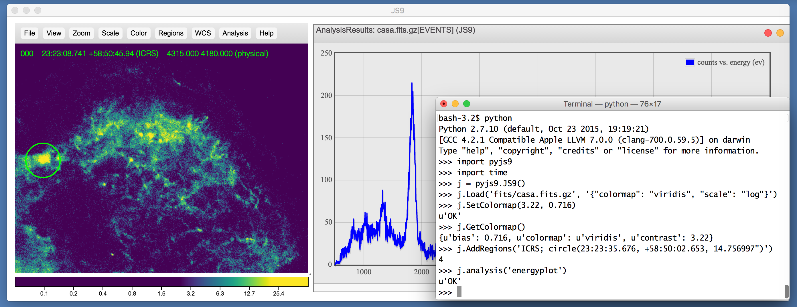

JS9: astronomical image display everywhere
==========================================

What does it do?
----------------

  - display FITS images, binary tables, data cubes, and multi-extension files
  - colormaps, scaling, pan, zoom, binning, blending, print, export ...
  - region support: create, manipulate, import, export, ...
  - drag and drop images, regions, catalogs
  - server-side and local analysis using the JS9 public API
  - control JS9 using scripts from the Linux shell or Python
  - runs on Macs, Linux, Windows, iPads, iPhones, ...
  - runs as a Desktop app, in all modern browsers, mobile apps are coming ...

How can I try it out?
---------------------

Go to [JS9 web site](http://js9.si.edu) and drag a
[FITS](https://fits.gsfc.nasa.gov/) data file onto the JS9 display:

    http://js9.si.edu

The JS9 web site also contains on-line documentation, demos, and
release downloads.

To install or not to install ...
--------------------------------

For many users, there is no need to install: simply use the [JS9 web
site](http://js9.si.edu) to display your data. You can even upload your
FITS files to the web site and run our server-side analysis.

Installing JS9 allows you to create your own web pages, tailor site
parameters, and add your own local and server analysis tasks. Grab the
latest version from [JS9 on GitHub](https://github.com/ericmandel/js9):

    git clone https://github.com/ericmandel/js9

Load a local page into your browser:

    file:///path/to/js9/js9.html

(NB: Chrome needs to run with the --allow-file-access-from-files switch to use
the file URI.)

For Desktop use, install [Electron.js](http://electron.atom.io) and generate *js9* script:

    ./mkjs9 -q

Use the *js9* script to start the Desktop app and load an image:

    js9 -a ~/data/m13.fits

For more advanced support (web-based support, support for handling large files),
build the JS9 helper and install JS9 in a web directory:

    # configure location to install the JS9 web files,
    # where to find cfitsio library and include files,
    # where to install programs and scripts,
    # what sort of helper to build:
    ./configure --with-webdir=[path_to_web_install] \
                --with-cfitsio=[path_to_cfitsio]    \
                --prefix=[path_to_prog_install]     \
                --with-helper=nodejs

    # the usual ...
    make
    make install

    # start helper
    cd path_to_web_install
    node js9Helper.js 2>&1 > js9node.log &

What about scripting?
---------------------

The *js9* script allows you to control a JS9 web page from the Linux
command line using the JS9 Public API (scripting requires installation of
JS9 and either [node.js](https://nodejs.org/) or
[Electron.js](http://electron.atom.io)):

    js9 Load chandra.fits '{"scale":"log","colormap":"red","contrast":5.78,"bias":0.15}'
    js9 Load spitzer.fits '{"scale":"log","colormap":"blue","contrast":6.3,"bias":0.54}'
    js9 ReprojectData chandra.fits

Python users can install [pyjs9](https://github.com/ericmandel/pyjs9):

    git clone https://github.com/ericmandel/pyjs9
    ...
    import pyjs9
    j = pyjs9.JS9()
    j.Load('chandra.fits', '{"scale":"log","colormap":"red","contrast":5.78,"bias":0.15}')
    j.Load('spitzer.fits', '{"scale":"log","colormap":"blue","contrast":6.3,"bias":0.54}')
    j.ReprojectData('chandra.fits')

What's the license?
-------------------

JS9 is distributed under the terms of The MIT License.

Who's responsible?
-------------------

Eric Mandel, Alexey Vikhlinin

Harvard-Smithsonian Center for Astrophysics
